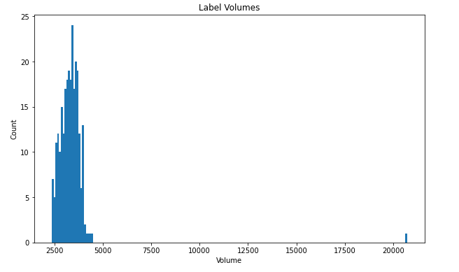
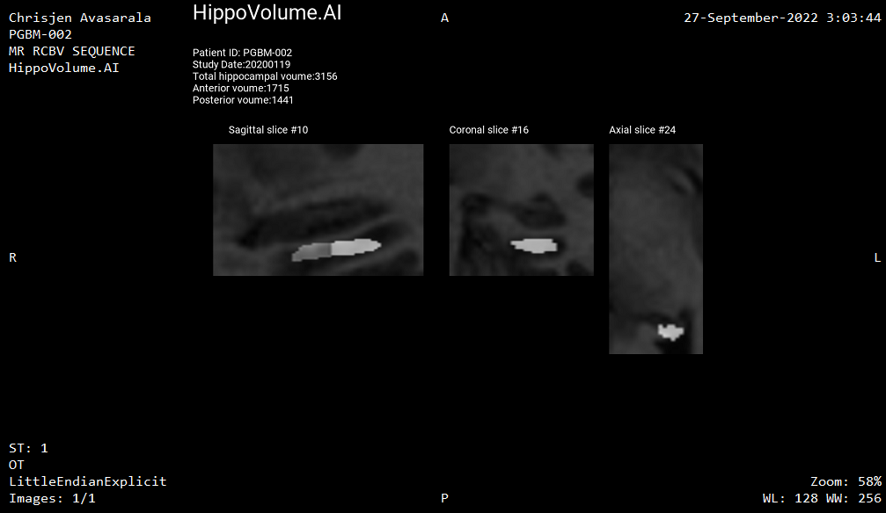

# Validaton Plan

**Your Name:**  Tai Le

**Name of your Device:** HippoVolume AI: Hippocampus Volume Quantification in Alzheimer's Progression

## General Information

**Intended Use Statement:**

To assist Radiologists in quantifying Hippocampal volume for Alzheimer's progression on 3D MR head images.

**Indication for Use:**

HippoVlume AI is a software model used to assist Radiologists to measure and track the volume of hippocampus  over time. MRI images are from both human female and male patients.

**Device Limitations:**


- The model performance is highly degraded without the sufficient use of computing infrastructure such as CPU/GPU, fast network I/O and RAM.
- The quality and sufficient amount of data used in training, validation and inference are important to the model classification.
- Patients with other neurodegenerative diseases may affect their hippocampus volume.
- According to [Nobis et al](https://www.sciencedirect.com/science/article/pii/S2213158219302542)., 2019, the volume of hippocampus varies in a population, depending on various parameters, within certain boundaries, and it is possible to identify a "normal" range taking into account age, sex and brain hemisphere


## Databases

### Dataset
- The data was taken from [Medical Decathlon competition](http://medicaldecathlon.com/). The dataset is stored as a collection of NIFTI files, with one file per volume, and one file per corresponding segmentation mask. The original images  are T2 MRI scans of the full brain.
- The labels were produced manually. The accuracy would depend on the radiologist experence in examing hippocampus.
- Regarding to the labeling, the Anterior of the Hippocampus is labeled as 1. The Posterior of the Hippocampus is labeled as 2. The background is labeled as 0.
- The dataset was split into Training and Test datasets 80 and 20 respectively. From the training data, data was split further to training and validation 80/20 respectively.

##### Dataset Volume Histogram



- The U‐net convolutional network architecture was used for segmentation.



## Ground Truth Acquisition Methodology

The labels were produced manually.The accuracy would depend on the radiologist experence in examing hippocampus.

## Algorithm Performance

The following peformance methods were used:

- Dice similarity coefficient (DSC)
- Jaccard similarity coefficient (JSC)
- Sensitivity
- Specificity

For the dataset, the DSC was about about 0.90, and JSC mean was about 0.81.

The sensitivity was about 0.86, and specificity was 0.99 indicating that the model can identify 86% of the hipcampus and 99% of the non-hippocampus properly. 

## References

- https://www.sciencedirect.com/science/article/pii/S2213158219302542
- http://medicaldecathlon.com/


```python

```
